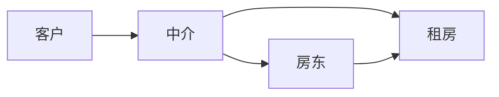
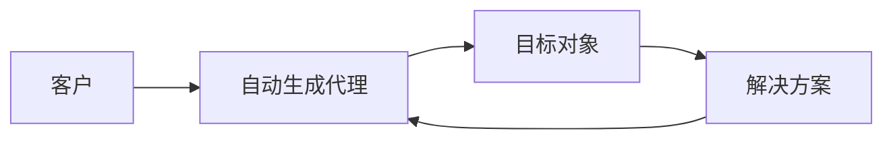
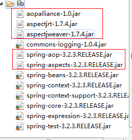
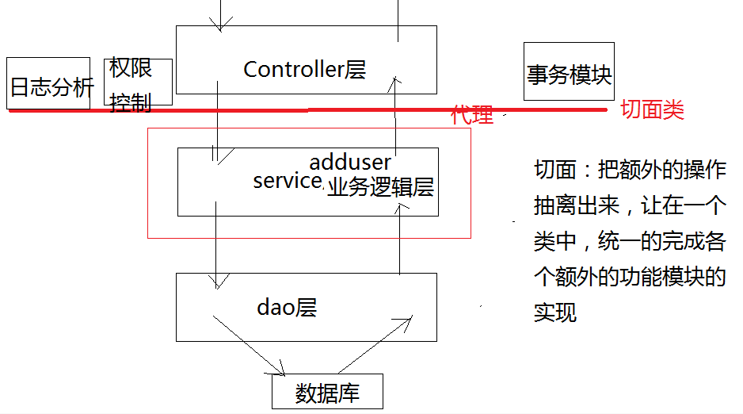

# spring

- [ ] 代理模式
- [ ] AOP

## 代理模式

> 中介



### 静态代理

> 实现了**事务控制层**与**业务逻辑层**之间的**解耦** 

1. 根据需求，编写事务控制的模块
2. 根据需求，使用静态代理模式编写代理类
3. 根据流程图，调整`web`层->`proxy`代理->`service`层之间的依赖关系
    *  `web`层：不需要改动代码
    *  `proxy`代理：主要目的是让`web`层依赖代理对象
    *  `service`层：主要目的是，让代理对象依赖真实有效的目标对象，然后调用真实有效的方法

#### 静态代理模式的优点

1. 实现了业务层与事务控制层之间的解耦
2. 代理类能够完成本职工作的调用（目标对象的方法调用）
3. 代理类还能够完成额外的操作（对业务逻辑方法添加事务控制）

#### 静态代理模式的缺点

1. 一个业务模块，必须要对应一个代理类
2. 事务控制的代码依然会有大量重复

#### 静态代理模式实现的前提条件

> **必须要实现目标对象的相同接口**

#### 静态代理模式与装饰者模式的区别

* 装饰者模式：是对目标对象的一种**增强实现**，相当于对一个人化妆：
* 静态代理模式是对目标对象的一种**解耦实现**，相当于对目标对象做了一个代理工作，产生了一个代理对象

### 动态代理

> 代码编译期间不存在代理类，运行期间自动产生代理类和代理对象




动态代理的实现技术：
- [x] `java`的反射机制
- [x] 回调函数

动态代理的实现方式：
- [x] `jdk`提供的动态代理
- [x] `spring`提供的`CGlib`动态代理

#### JDK的动态代理实现——JDKDynamicProxy

> 使用了`Java`提供的`Proxy`类和`InvocationHandler`接口

1. 创建一个动态代理的解决方案的类：`JDKDynamicProxy`
2. 在`JDKDynamicProxy`类中，添加两个成员变量：目标对象（本职的操作）、事务控制（额外的操作）
3. 在`JDKDynamicProxy`类中，添加构造方法，完成成员变量的初始化
4. 在`JDKDynamicProxy`类中，非静态的自定义方法`getProxy()`：主要使用`java.lang.reflect.Proxy`类完成目标对象的代理类和代理对象

``` java
//完成动态代理(解决方案)生成代理类和代理对象的过程
	public Object getProxy() {
		/* 
		 * ClassLoader loader ：类加载器
		 *     理解思路：1、代理类不存在，所有就没有相应的类加载器
		 *              2、可以使其项目中的，其他的类获取类加载器
		 * 
		 * Class<?>[] interfaces, : 表示 目标对象的类 所实现的所有的接口
		 * 		理解思路: 1、为了让代理类 看起来 和 目标对象的类 一样，方法完全一样
		 *               2、就是 实现目标对象的类的所有接口
		 * InvocationHandler h : 表示  代理对象的方法重写
		 *      理解思路：1、方法的重写主要是为了完成 额外的操作 （事务开启与事务提交）、
		 *               2、完成本职工作：调用目标对象的方法
		 */
		Class[] is = target.getClass().getInterfaces();
		Object proxy = Proxy.newProxyInstance(
				target.getClass().getClassLoader(), 
				target.getClass().getInterfaces(), 
				this);
		return proxy;
	}
```

5. 在`JDKDynamicProxy`类中，添加回调函数，主要完成 ：当客户端发起请求时，拦截到该方法，进入`invoke()`方法中，完成额外操作和本职的方法调用

``` java
//回调函数
	@Override
	public Object invoke(Object proxy, Method method, Object[] args)
			throws Throwable {
		//完成额外的操作
		tx.open1();
		
		//完成本职的工作：使用方法对象method.invoker()反射机制
		//方法对象是根据  客户端发送的不同方法调用完成的
		//result 是  目标对象的调用的方法返回值
		Object result = method.invoke(target, args);
		
		//完成额外的操作
		tx.commit();
		
		return result;
	}
```

* 特点：必须要求目标对象和代理对象**必须要实现相同的接口**

#### CGlib的动态代理

> 使用`spring`提供的`Enhancer`类和`MethodIntercepter`接口

1. 创建一个动态代理的解决方案的类：`CGlibDynamicProxy`
2. 在`CGlibDynamicProxy`类中，添加两个成员变量：目标对象（本职的操作）、事务控制（额外的操作）
3. 在`CGlibDynamicProxy`类中，添加构造方法，完成成员变量的初始化
4. 在`CGlibDynamicProxy`类中，非静态的自定义方法`getProxy()`：主要使用`org.springframework.cglib.proxy.Enhancer`类完成目标对象的代理类和代理对象

``` java
//cglib动态代理的核心代码：生成代理类
	public Object getProxy() {
		Enhancer enhancer = new Enhancer();
		//设置目标对象 为  代理对象 的 父类
		enhancer.setSuperclass(target.getClass());
		//设置一个回调函数
		enhancer.setCallback(this);
		//创建代理对象
		return enhancer.create();
	}
```

1. 在`CGlibDynamicProxy`类中，添加回调函数，主要完成：当客户端发起请求时，拦截到该方法，进入`intercept()`方法中，完成额外操作和本职的方法调用

``` java
//回调函数
	@Override
	public Object intercept(Object proxy, Method method, Object[] args,
			MethodProxy methodProxy) throws Throwable {
		
		//完成额外的操作
		tx.open1();
		
		//完成本职的工作：使用方法对象method.invoker()反射机制
		//方法对象是根据  客户端发送的不同方法调用完成的
		//result 是  目标对象的调用的方法返回值
		Object result = method.invoke(target, args);
		
		//完成额外的操作
		tx.commit();
		
		return result;
	}
```

* `CGlib`的特点：目标对象是作为代理对象的**父类**没有必要实现接口

## spring的AOP面向切面编程

### 入门案例

1. 导包



2. 配置头文件——`aop`的约束

``` xml
<?xml version="1.0" encoding="UTF-8"?>
<beans xmlns="http://www.springframework.org/schema/beans" 
	xmlns:context="http://www.springframework.org/schema/context" 
	xmlns:aop="http://www.springframework.org/schema/aop" 
	xmlns:util="http://www.springframework.org/schema/util" 
	xmlns:xsi="http://www.w3.org/2001/XMLSchema-instance" 
	xsi:schemaLocation="http://www.springframework.org/schema/beans 
	http://www.springframework.org/schema/beans/spring-beans-3.2.xsd 
	http://www.springframework.org/schema/context 
	http://www.springframework.org/schema/context/spring-context-3.2.xsd 
	http://www.springframework.org/schema/util 
	http://www.springframework.org/schema/util/spring-util-3.2.xsd 
	http://www.springframework.org/schema/aop 
	http://www.springframework.org/schema/aop/spring-aop-3.2.xsd ">
```

3. 编写切面类

``` java
package aspect;

import org.aspectj.lang.ProceedingJoinPoint;
import org.aspectj.lang.annotation.Aspect;
import org.springframework.beans.factory.annotation.Autowired;
import org.springframework.stereotype.Component;

import tx.TransactionManager;

//切面类
@Component
//使用注解：表示出该类为切面
@Aspect
public class TxAspect {
	
	@Autowired
	private TransactionManager tx;
	
	//通知的方法 ：环绕通知
	public void around(ProceedingJoinPoint joinPoint) throws Throwable {
		//在方法之前进行 事务开启 的通知   额外的操作
		tx.open1();
		
		//本职工作
		joinPoint.proceed();
		
		//在方法之后进行  事务提交  的通知  额外的操作
		tx.commit();
	}
}
```

4. 编写核心的配置文件

``` xml
<!-- 配置aop的切面 -->
	<aop:config>
		<!-- 设置切面类的引用 -->
		<aop:aspect ref="txAspect">
			<!-- 配置切入点 -->
			<aop:pointcut expression=
			"within(service.UserServiceImpl)" id="pc"/>
			<!-- 配置切面的通知 ： 完成额外的操作  以及  本职工作 -->
			<!-- 绑定切入点  同时   找到环绕通知的方法 -->
			<aop:around method="around" pointcut-ref="pc" />
		</aop:aspect>
	</aop:config>
```



* `AOP`的底层是动态代理模式
* `AOP`的技术不是`spring`独有的，而是`spring`在`AOP`的基础上进行再次封装

### 名词解释

1. 把**与业务逻辑无关**的代码抽离出来，写在一个类中，该类就是切面类
2. 切面类主要负责**完成额外的操作（事务控制）**以及**本职的方法**
3. 切面类是对`service`层的方法进行额外操作的，那么就需要定义一个切入点，该切入点就是指向`service`层的方法
4. 在执行`service`层的方法时，切面类**先进行事务控制**（事务的开启、事务的提交），那么该方法就是**通知**
5. 在执行完额外通知后，需要进行本职工作的调用。那么，本职方法的调用是通过**连接点完成的**(`addUser()`方法)

* 切面：把与业务逻辑紧密结合的代码抽离出来，放在一个统一的类中。该类是**切面类**，主要作用是：完成特定的功能模块（事务模块）的方法。切面实现的模块主要包括：（这些模块与业务逻辑无关）
	* 数据库中的事务
	* 数据库连接池
	* 权限控制
	* 日志分析
	* 安全性的处理
* 切入点：一种匹配规则，比如：在`service`层的`UserServiceImpl`类上加入切入点，就表示该切面类中的事务控制，对  `UserServiceImpl`中的方法生效了。
	* 只有满足了匹配规则的方法,才能执行通知
* 通知：切面中的**方法**(主要实现额外的操作)
* 连接点：客户端通过代理对象调用的方法(完成本职的操作)
	* 主要实现本职方法的操作
* 目标对象：真实有效的对象方法的执行
