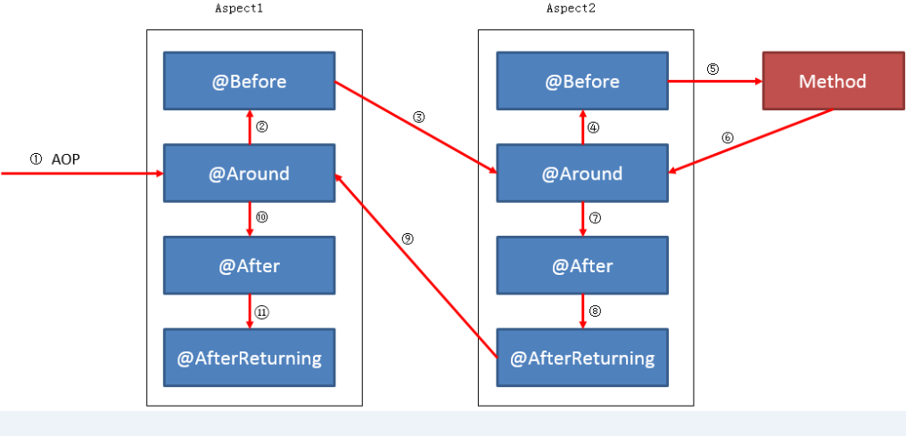

# sping

- [ ] 切入点表达式
- [ ] 使用注解的方式进行切面配置
- [ ] AOP的底层原理
- [ ] AOP练习

## 切入点表达式

### 粗粒度表达式

``` xml
<aop:pointcut expression="within(service.UserServiceImpl)" id="pc"/>
<!-- service层的直接类 （第一层的类）-->
<aop:pointcut expression="within(service.*)" id="pc"/>
<!-- service层包的下一层包中的类  service.aaa.类   -->
<aop:pointcut expression="within(service.*.*)" id="pc"/>
<!-- service包下面所有的包下所有的类   但是 :  返回值类型void  -->
<aop:pointcut expression="within(service..*)" id="pc"/>
```

* 粗粒度的表达式局限性太大，只能针对返回值类型为`void`的方法，不建议使用

### 细粒度表达式

``` xml
<!--语法格式-->
<!--Expression="execution(返回值类型 包名.类名.方法名(包名.参数的类型))-->

<!-- 细粒度 匹配 单独的一个方法 -->
<aop:pointcut expression="execution(void service.UserServiceImpl.addUser(pojo.User))" id="pc"/>
<aop:pointcut expression="execution(void service.UserServiceImpl.*(pojo.User))" id="pc"/>
<!-- 细粒度  匹配 service包下的  直接类  中的所有返回值类型为void的方法 -->
<aop:pointcut expression="execution(void service.*.*(..))" id="pc"/>
<!-- 细粒度  匹配 service包下的所有的类 中 所有的方法 包括所有的不同的返回值类型 -->
<aop:pointcut expression="execution(* service..*.*(..))" id="pc"/>
```

## 使用注解的形式简化核心配置文件

1. 核心配置文件

    ``` xml
    <!-- 开启AOP注解的扫描 -->
    <aop:aspectj-autoproxy/>
    ```

2. 在切面类，添加`@Aspect`注解

    ``` java
    package aspect;

    import org.aspectj.lang.ProceedingJoinPoint;
    import org.aspectj.lang.annotation.Around;
    import org.aspectj.lang.annotation.Aspect;
    import org.springframework.beans.factory.annotation.Autowired;
    import org.springframework.stereotype.Component;

    import annotation.Transactional;

    import tx.TransactionManager;

    @Component
    @Aspect   //表示使用注解的形式，让spring知道 我是 切面类
    public class TxAspect {

        @Autowired
        private TransactionManager tx;
        
        //注意：在结合使用  细粒度表达式 ， 返回值类型最好写上Object
        //因为：有些方法的而返回值类型不为void，那么就需要获取方法的执行结果
        @Around(value="execution(* service..*.*(..)) && @annotation(trans) ")
        public Object around(ProceedingJoinPoint joinPoint, Transactional trans) throws Throwable {
            tx.open1();
            Object result = joinPoint.proceed();
            tx.commit();
            return result;
        }
    }
    ```

3. 在切面类中，添加`@Around`注解

    ``` java
    @Around(value="execution(* service..*.*(..)) && @annotation(trans) ")
    ```

## 自定义的注解

1. 编写一个注解类：**注解包.注解类**

    ``` java
    package annotation;

    import java.lang.annotation.ElementType;
    import java.lang.annotation.Retention;
    import java.lang.annotation.RetentionPolicy;
    import java.lang.annotation.Target;

    //自定义注解的形式
    @Target(ElementType.METHOD)   //表示 该注解  是 对谁使用的？对类中的某个方法使用
    //@Target(ElementType.FIELD)   //表示  对 类中的 字段添加注解
    //@Target(ElementType.CONSTRUCTOR) //表示  对构造函数 添加注解
    @Retention(RetentionPolicy.RUNTIME) //表示  该注解是在程序运行过程中使用，在内存中存储
    //@Retention(RetentionPolicy.SOURCE) //表示  该注解 是在 源文件中使用的，运行中无效
    //@Retention(RetentionPolicy.CLASS)  // 表示 运行过程中 该注解生效，但是运行完毕从内存中消失
    public @interface Transactional {
        //注解的形式：  @注解 (value="")
    //	public String value();
    }
    ```

2. 在切面类中的`around`方法上，添加自定义注解的匹配规则

    ``` java
    @Around(value="execution(* service..*.*(..)) && @annotation(trans) ")
    ```

3. 在`around`方法的参数列表位置，添加自定义注解的形参

    ``` java
    @Around(value="execution(* service..*.*(..)) && @annotation(trans) ")
        public Object around(ProceedingJoinPoint joinPoint, Transactional trans) throws Throwable {
            tx.open1();
            Object result = joinPoint.proceed();
            tx.commit();
            return result;
        }
    ```

4. 在`userServiceImpl`类中，找到需要进行事务控制的方法，然后对其添加注解

    ``` java
    @Transactional
        public void addUser(User user) {
            //tx.open();
            userDao.addUser(user);
            //tx.commit();
        }
    ```

5. 在自定义的注解中需要进行`key = value`的键值对设计时，在注解类中的写一个自定义方法

    ``` java
    public @interface Transactional {
        //注解的形式：  @注解 (value="")
    //	public String value();
    }
    ```

## spring当中的五大通知

### 环绕通知（Around Advice）

> 表示在目标方法 **执行的前后添加相应的额外操作**。

``` java
//通知的方法 ：环绕通知
// @Around(value="execution(* service..*.*(..))")
@Around(value="pointCut()")
public Object around(ProceedingJoinPoint joinPoint) throws Throwable {
    //在方法之前进行 事务开启 的通知   额外的操作
    tx.open1();
            
    //本职工作
    Object result = joinPoint.proceed();
            
    //在方法之后进行  事务提交  的通知  额外的操作
    tx.commit();
            
    return result;
}
```

### 前置通知（Before Advice）

> 表示在目标方法 **执行之前进行额外的操作**。

``` java
//前置通知：主要是用在 日志分析 日志监控 
//前置通知  没有执行 目标方法
//JoinPoint 主要用在  非环绕通知中
@Before(value="pointCut()")
public void before(JoinPoint joinPoint) {
    System.out.println("前置通知");
    //如何获取  连接点方法的 方法名addUser方法
    //1、获取  目标对象的类型
    Class targetClass = joinPoint.getTarget().getClass();
    System.out.println(targetClass);
            
    //2、获取 该类中的 方法签名对象
    MethodSignature methodSignature = (MethodSignature) 
    joinPoint.getSignature();
            
    //3、获取 方法名
    String methodName = methodSignature.getName();
    System.out.println(methodName);
}
```

### 后置通知 (AfterRetuning Advice)

> 是在 **目标方法执行完毕之后**，才执行的。

* **前提条件：必须让环绕通知执行结束之后，添加方法放回的结果**

1. 在核心配置文件中，添加后置通知的标签

    ``` xml
    <!--returning="" 把环绕通知中的结果，返回到后置通知中获取-->
    <aop:after-returning method="afterReturning" returning="number" pointcut-ref="pc"/>
    ```

2. 在切面类中，添加自定义方法`afterReturning(int number)`

    ``` java
    //后置通知
        // int number 表示 与 环绕通知执结果之后的 参数类型一致
        @AfterReturning(value="pointCut()",returning="number")
        public void afterReturning(int number) {
            System.out.println("后置通知");
            System.out.println(number);
        }
    ```

3. 特别注意：需要修改环绕通知的返回值类型

    ``` java
    //通知的方法 ：环绕通知
    //	@Around(value="execution(* service..*.*(..))")
        @Around(value="pointCut()")
        public Object around(ProceedingJoinPoint joinPoint) throws Throwable {
            //在方法之前进行 事务开启 的通知   额外的操作
            tx.open1();
            
            //本职工作
            Object result = joinPoint.proceed();
            
            //在方法之后进行  事务提交  的通知  额外的操作
            tx.commit();
            
            return result;
        }
    ```

* 后置通知一般用于 **日志分析**与 **日志监控**。同时表示，方法执行完毕之后，需要拿到相应的返回值结果做分析。

### 异常通知(AfterThrowing Advice)

> 在目标方法执行过程中，如果发生了异常，**对异常信息进行捕获和处理**

异常出现时，环绕通知的方法执行过程中就会报错，然后，直接把异常结果交给了异常通知去处理。环绕通知的事务提交方法 **没有执行**，同时，后置通知的方法也 **没有执行**。

1. 在配置文件中，编写异常通知的标签

    ``` xml
    <aop:after-throwing method="afterThrowing" throwing="throwable" pointcut-ref="pc"  />
    ```

2. 在切面类中，编写自定义方法：`afterThrowing(Throwable throwable)`，获取所有的异常类型

    ``` java
    //异常通知
    //Throwable throwable 所有异常的顶级父类，能够捕获所有的异常
    @AfterThrowing(value="pointCut()",throwing="throwable")
    public void afterThrowing(Throwable throwable) {
        System.out.println("异常通知");
        System.out.println("异常信息："+throwable.getMessage());
    }
    ```

3. 在业务方法中，添加一个模式异常的操作
   
    ``` java
    int i = 1/0;
    ```

* 异常通知，主要是进行异常的捕获和分析。**在方法执行过程中进行捕获。**

### 最终通知（After(finally) Advice）

> 无论目标方法是否成功执行，**都会进行最终通知的执行**

``` java
//最终通知
@After(value="pointCut()")
public void after() {
    System.out.println("最终通知");
}
```

### 多个切面通知切入，环绕通知的执行逻辑



1. 在切面包中，定义两个自定义的切面 `AroundA` 、`AroundB`
2. 添加相应的注解，直接进行测试即可。

好处：根据不同的需求，程序员只需要写好切面类即可

## springAOP面向切面编程的原理

> 底层是 **动态代理模式**，而动态代理模式有两种：`jdk`的动态代理和`CGlib`的动态代理

* `springAOP`默认的底层动态代理的规则
    * 当业务逻辑层 **有接口实现时**，`springAOP`底层是`JDK`的动态代理
    * 当业务逻辑层 **没有接口实现时**，`springAOP`底层是`CGlib`的动态代理

### 人为的修改springAOP默认的动态代理的规则

``` xml
<!-- 配置aop的切面 -->
<!-- 
    proxy-target-class="false"  表示 采用默认的规则
    proxy-target-class="true"  表示 人为指定cglib的动态代理
-->
    <aop:config proxy-target-class="true" >
```

### AOP的调用过程

1. 当客户端发起请求时，该请求会先执行到 **切面类**。它是根据切入点的匹配规则找到相应的方法
2. 切面类中，使用 **环绕通知**的形式，先执行额外的操作，在执行本职的工作
3. 在执行本职工作时，**是根据连接点执行的**。`ProceedingJoinPoint`类，该类通过 **反射机制**，找到了连接点方法  `addUser()`方法。
 
### 环绕通知

``` java
//环绕通知
@Around(value="execution(* service..*.*(..))")
public Object around(ProceedingJoinPoint joinPoint) throws Throwable {
    Object result = null;
 
    //1、获取目标对象的类型
    Class targetClass = joinPoint.getTarget().getClass();
     
    //2、获取方法签名对象
    //注意：通过方法签名对象无法获取注解
    MethodSignature methodSignature = (MethodSignature) joinPoint.getSignature();
     
    //3、获取方法名 --->  能够直接通过方法签名对象获取
    String methodName = methodSignature.getName();
     
    //4、获取参数列表
    Class[] argsClass = methodSignature.getParameterTypes();
     
    //5、通过java的反射机制完成方法对象的创建
    Method method = targetClass.getMethod(methodName, argsClass);
     
    //6、先判断该方法对象中是否有 注解
    if (method.isAnnotationPresent(PrivilegeAnno.class)) {
        //具有注解
        //7、获取 方法对象上的注解
        PrivilegeAnno priInfo = method.getAnnotation(PrivilegeAnno.class);
        //9、获取 注解对象中的name属性的值
        String priName = priInfo.name();
        //10、匹配权限列表，如果匹配成功，执行方法，如果不成功，给出提示
        List<String> priList = PrivilegeUtil.getPriList();
         
        if (priList.contains(priName)) {
            //表示有相应的权限
            System.out.println("恭喜您  拥有权限");
            result = joinPoint.proceed();
        } else
            //表示没有相应的权限
            System.out.println("对不起  您没有相应的权限");
    } else
        //8、没有注解,执行放行该方法
        result = joinPoint.proceed();
    return result;
}
```
