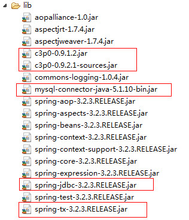

# spring

- [ ] `spring`整合`jdbc`的模板类：`JdbcTemplate`
- [ ] `spring`提供的事务控制

## JdbcTemplate

### 核心配置文件的编写

1. 导入`jar`包

    

2. 编写`spirng`的核心配置文件：配置头文件约束

    ``` xml
    <?xml version="1.0" encoding="UTF-8"?>
    <beans xmlns="http://www.springframework.org/schema/beans"
        xmlns:xsi="http://www.w3.org/2001/XMLSchema-instance"
        xmlns:context="http://www.springframework.org/schema/context"
        xmlns:aop="http://www.springframework.org/schema/aop"
        xmlns:tx="http://www.springframework.org/schema/tx"
        xsi:schemaLocation="http://www.springframework.org/schema/beans
                            http://www.springframework.org/schema/beans/spring-beans.xsd
                            http://www.springframework.org/schema/context
                            http://www.springframework.org/schema/context/spring-context.xsd
                            http://www.springframework.org/schema/aop
                            http://www.springframework.org/schema/aop/spring-aop.xsd
                            http://www.springframework.org/schema/tx
                            http://www.springframework.org/schema/tx/spring-tx.xsd">
    ```

3. 编写`jdbc.properties`配置文件，配置数据源的参数

    ``` properties
    jdbcDriver=com.mysql.jdbc.Driver
    jdbcUrl=jdbc:mysql://localhost:3306/spring
    jdbcUser=root
    jdbcPwd=1234
    ```

4. `spring`通过 `<context:property-placeholder>`读取`jdbc`的配置文件

    ``` xml
    <context:property-placeholder location="classpath:/jdbc.properties"/>
    ```

5. `spring`配置`c3p0`连接池

    ``` xml
    <bean id="dataSource" class="com.mchange.v2.c3p0.ComboPooledDataSource">
            <property name="driverClass" value="${jdbcDriver}">
            </property>
            <property name="jdbcUrl" value="${jdbcUrl}">
            </property>
            <property name="user" value="${jdbcUser}">
            </property>
            <property name="password" value="${jdbcPwd}">
            </property>
            <property name="maxPoolSize" value="20">
            </property>
            <property name="minPoolSize" value="3">
            </property>
        </bean>
    ```

6. 单元测试

    ``` java
        @Test
        public void test01() throws SQLException {
            ApplicationContext context = new ClassPathXmlApplicationContext("applicationContext.xml");
            DataSource dataSource = (DataSource) context.getBean("dataSource");
            Connection conn = dataSource.getConnection();
            String sql = "insert into user(id, name, age) values(null, ?, ?)";
            PreparedStatement pstm = conn.prepareStatement(sql);
            pstm.setString(1, "aaa");
            pstm.setInt(2, 10);
            pstm.executeUpdate();
        }
    ```

### 使用spring整合jdbc---jdbc模板类

1. 在配置文件中，配置模板类

    ``` xml
    <bean id="jdbcTemplate" class="org.springframework.jdbc.core.JdbcTemplate">
        <property name="dataSource" ref="dataSource"></property>
    </bean>
    ```

2. 在单元测试中，通过`spring`容器获取模板类`JdbcTemplate`的对象

    ``` java
    @Test
    public void test02() {
        JdbcTemplate jdbcTemplate = (JdbcTemplate) context.getBean("jdbcTemplate");
        String sql = "insert into user(id, name, age) values(null, ?, ?)";
        jdbcTemplate.update(sql, "bbb", 10);
    }
    ```

3. 使用模板类的对象中的`update`方法，完成数据的插入
4. `jdbcTemplate`的执行原理

    ``` java
    protected int update(final PreparedStatementCreator psc, final PreparedStatementSetter pss)
                throws DataAccessException {

            logger.debug("Executing prepared SQL update");
            return execute(psc, new PreparedStatementCallback<Integer>() {
                @Override
                public Integer doInPreparedStatement(PreparedStatement ps) throws SQLException {
                    try {
                        if (pss != null) {
                            pss.setValues(ps);
                        }
                        int rows = ps.executeUpdate();
                        if (logger.isDebugEnabled()) {
                            logger.debug("SQL update affected " + rows + " rows");
                        }
                        return rows;
                    }
                    finally {
                        if (pss instanceof ParameterDisposer) {
                            ((ParameterDisposer) pss).cleanupParameters();
                        }
                    }
                }
            });
        }
    ```

### 通过JdbcTemplate模板类进行增删改查的操作

``` java
    private ApplicationContext context;
    private JdbcTemplate jdbcTemplate;
    private UserServlet userServlet;
    private User user;
    private Person person;

    @Before
    public void before() {
        context = new ClassPathXmlApplicationContext("applicationContext.xml");
        jdbcTemplate = (JdbcTemplate) context.getBean("jdbcTemplate");
        userServlet = (UserServlet) context.getBean("userServlet");
        user = new User();
        user.setAge(100);
        user.setName("测试用户");
        person = new Person();
        person.setPage(11);
        person.setPname("wwww");
    }
```

``` java
    @Test
    public void test01() throws SQLException {
//        ApplicationContext context = new ClassPathXmlApplicationContext("applicationContext.xml");
        DataSource dataSource = (DataSource) context.getBean("dataSource");
        Connection conn = dataSource.getConnection();
        String sql = "insert into user(id, name, age) values(null, ?, ?)";
        PreparedStatement pstm = conn.prepareStatement(sql);
        pstm.setString(1, "aaa");
        pstm.setInt(2, 10);
        pstm.executeUpdate();
    }
```

``` java
    @Test
    public void test02() {
//        JdbcTemplate jdbcTemplate = (JdbcTemplate) context.getBean("jdbcTemplate");
        String sql = "insert into user(id, name, age) values(null, ?, ?)";
        jdbcTemplate.update(sql, "bbb", 10);
    }
```

``` java
    @Test
    public void test03() {
        String sql = "update user set name=?,age=? where id=?";
        int rows = jdbcTemplate.update(sql, "1806", 10, 1);
        System.out.println("SUCCESS " + rows);
    }
```

``` java
    @Test
    public void test04() {
        String sql = "delete from user where id=?";
        int rows = jdbcTemplate.update(sql, 2);
        System.out.println("SUCCESS " + rows);
    }
```

``` java
    @Test
    public void test05() {
        String sql = "select * from user";
        List<Map<String, Object>> list = jdbcTemplate.queryForList(sql);
        list.forEach(System.out::println);
    }
```

### 对结果集进行再次的包装

> `RowMapper<T>`的作用是：提供一个方法，专门用于遍历`ResultSet`集合，然后程序员手动进行逐行的封住数据到`User`对象中。

1. 编写`UserMapper`

    ``` java
    package mapper;

    import org.springframework.jdbc.core.RowMapper;
    import pojo.User;

    import java.sql.ResultSet;
    import java.sql.SQLException;

    public class UserMapper implements RowMapper<User> {
        @Override
        public User mapRow(ResultSet rs, int rowNum) throws SQLException {
            User user = new User();
            user.setId(rs.getInt(1));
            user.setName(rs.getString(2));
            user.setAge(rs.getInt(3));
            System.out.println("row " + rowNum);
            return user;
        }
    }
    ```

2. 编写单元测试

    ``` java
    @Test
    public void test06() {
        String sql = "select * from user";
        RowMapper<User> rowMapper = new UserMapper();
        List<User> list = jdbcTemplate.query(sql, rowMapper);
        list.forEach(System.out::println);
    }
    ```

### spring提供的全自动封装规则

> `RowMapper<T>`接口和`BeanPropertyRowMapper<T>`的实现类

1. 直接使用`BeanPropertyRowMapper`

    ``` java
    @Test
    public void test07() {
        String sql = "select * from user";
        RowMapper<User> rowMapper = new BeanPropertyRowMapper<>(User.class);
        List<User> list = jdbcTemplate.query(sql, rowMapper);
        list.forEach(System.out::println);
    }
    ```

### spring的模板类查询单个的结果集

1. 必须要使用映射规则（手动封装的规则）
2. 必须要使用`queryForObject(sql,rowMapper,参数?的值)`

    ``` java
    @Test
    public void test08() {
        String sql = "select * from user where id=?";
        RowMapper<User> rowMapper = new UserMapper();
        User user = jdbcTemplate.queryForObject(sql, rowMapper, 1);
        System.out.println(user);
    }
    ```

## spring的jdbc的事务控制

1. 配置事务管理器的`bean`标签

    ``` xml
    <bean id="transactionManager" class="org.springframework.jdbc.datasource.DataSourceTransactionManager">
            <property name="dataSource" ref="dataSource"></property>
        </bean>
    ```

2. 配置事务控制的通知：通过通知进行事务控制

    ``` xml
    <!--suppress XmlDefaultAttributeValue -->
        <tx:advice id="txAdvice" transaction-manager="transactionManager">
            <tx:attributes>
                <!--suppress XmlDefaultAttributeValue -->
                <tx:method name="add*" propagation="REQUIRED"/>
                <!--suppress XmlDefaultAttributeValue -->
                <tx:method name="delete*" propagation="REQUIRED"/>
                <!--suppress XmlDefaultAttributeValue -->
                <tx:method name="update*" propagation="REQUIRED"/>
                <!--<tx:method name="find*" propagation="NEVER" read-only="true"/>-->
                <tx:method name="find*" propagation="SUPPORTS"/>
                <tx:method name="*" read-only="true"/>
            </tx:attributes>
        </tx:advice>
    ```

3. 理解事务的传播行为

    * `propagation="REQUIRED"`
        * 在 **增加**、**删除**、**修改**方法中使用
    * `propagation="NEVER"`
        * 在`find`查询方法中使用
        * 表示不需要事务控制
    * `read-only="true"`
        * 事务的只读操作
    * `propagation="SUPPORTS"`
        * 表示可支持的事务控制
            * 如果，`find`方法中，有其他的方法存在事务，那么`find`方法就是进行事务控制。
            * 如果，`find`方法中，没有其他的事务控制在，那么`find`方法也没有事务控制。
1. 配置`AOP`的切面

    ``` xml
    <aop:config>
        <aop:pointcut id="pc" expression="execution(* service..*.*(..))"/>
        <aop:advisor advice-ref="txAdvice" pointcut-ref="pc"/>
        <aop:aspect ref="cacheMap">
            <aop:around method="around" pointcut-ref="pc"/>
        </aop:aspect>
    </aop:config>
    ```

### 事务控制的方式

#### 事务的开启

#### 事务的提交

> 正常操作成功，写入到了数据库当中

#### 事务的回滚

> 如果在事务控制的过程当中，发生了异常，那么事务会回滚

##### 异常的类型

1. `RuntimeException`("运行时异常")
2. 编译时的异常(检查异常)

#### 事务回滚的情况

##### spring默认的异常回滚的方式

* 在运行时异常出现的情况下，`spring`的事务控制会自动的进行回滚操作。
* 在编译时异常出现的情况下，`spring`的事务控制不会进行回滚。

##### 人为的去控制异常回滚的方式

* `rollback-for="异常的类型"`对某一种异常，专门进行事务回滚
* `no-rollback-for="异常的类型"`对某一种异常，不进行事务回滚

### 多表关联的操作时，事务的控制

**事务控制的原理：**

事务的通知是对所有的`add*`方法生效的
该事物通知对应的切面的切入点实在`service`层切入的
当执行到`service`层的业务逻辑时，`add*`方法中的访问数据库的操作已经添加了事务控制
此时，如果反生异常，那么所有的`dao`层的操作，**全部回滚**

* 好处：只要有一个表（增删改）时出现异常信息，那么所有的表中的 **数据全部回滚**

### 缓存机制

> 避免频繁的连接数据库，减少内存性能的开销

``` java
package aspect;

import org.aspectj.lang.ProceedingJoinPoint;
import org.aspectj.lang.annotation.Aspect;
import org.springframework.stereotype.Component;
import pojo.User;

import java.util.HashMap;
import java.util.Map;

//缓存的切面类
@Component
@Aspect
public class CacheMap {

    //定义一个成员变量 ：Map<int,Object>
    //int 指的是 ： 对象的id的值
    //object 值的是：对象
    //作用：把所有的数据缓存到map中
    private Map<Integer, Object> map = new HashMap<>();

    //定义 环绕通知
    public Object around(ProceedingJoinPoint joinPoint) throws Throwable {
        //查询操作，是根据id进行查询的
        //1、 获取方法的参数列表中的id的值
        //注意：getArgs()是获取  方法对应的参数列表中的值
        Object[] args = joinPoint.getArgs();
        int id = (Integer) args[0];

        //2、先从map集合中取数据
        User user = (User) map.get(id);

        //3、判断该user对象是否为空
        if (user == null) {
            //4、如果为空，执行目标方法，从数据库中查询
            System.out.println("没有缓存");
            user = (User) joinPoint.proceed();
            //6、把从数据库中查询的对象，放入缓存中
            map.put(id, user);
        } else {
            //5、如果不为空
            System.out.println("具有缓存");
        }
        return user;
    }
}
```
