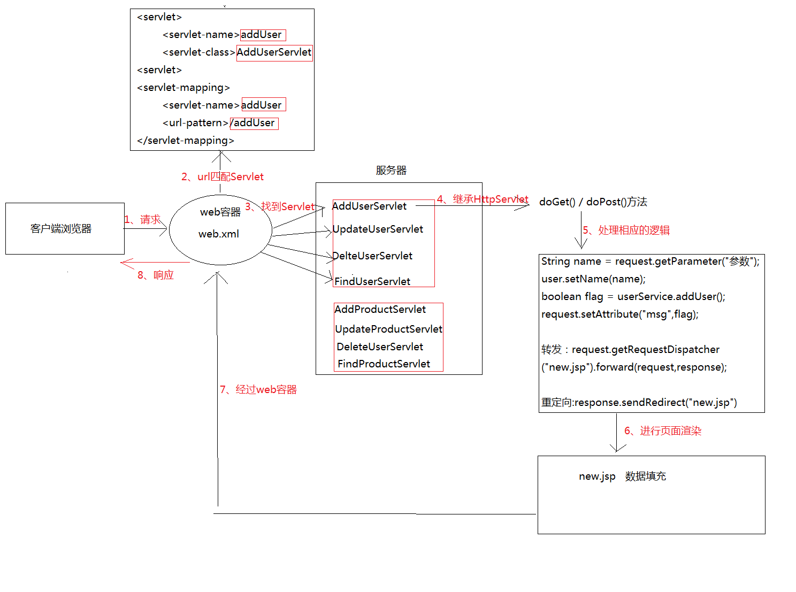
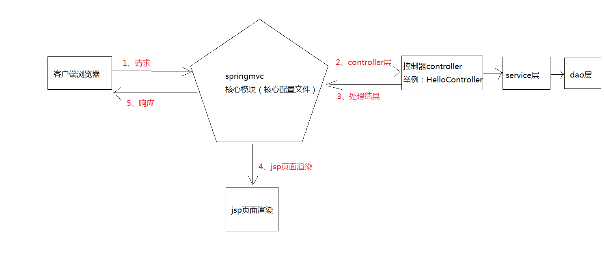
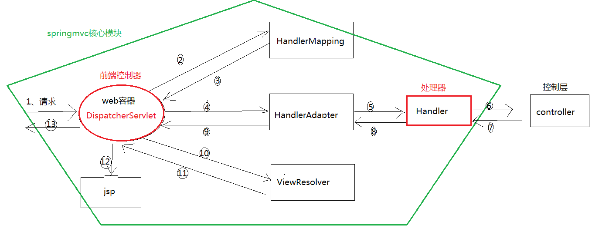

# springMVC

- [ ] springmvc整合servlet

## servlet的执行流程



## springmvc框架



## springmvc的执行流程



## 使用springmvc框架进行web案例的开发

1. 编写`web`容器的核心配置文件

    ``` xml
    <?xml version="1.0" encoding="UTF-8"?>
    <web-app xmlns="http://xmlns.jcp.org/xml/ns/javaee"
            xmlns:xsi="http://www.w3.org/2001/XMLSchema-instance"
            xsi:schemaLocation="http://xmlns.jcp.org/xml/ns/javaee http://xmlns.jcp.org/xml/ns/javaee/web-app_4_0.xsd"
            version="4.0">

        <context-param>
            <param-name>contextConfigLocation</param-name>
            <param-value>/WEB-INF/applicationContext.xml</param-value>
        </context-param>

        <listener>
            <listener-class>org.springframework.web.context.ContextLoaderListener</listener-class>
        </listener>

        <filter>
            <filter-name>encodingFilter</filter-name>
            <filter-class>org.springframework.web.filter.CharacterEncodingFilter</filter-class>
            <init-param>
                <param-name>encoding</param-name>
                <param-value>utf-8</param-value>
            </init-param>
        </filter>

        <filter-mapping>
            <filter-name>encodingFilter</filter-name>
            <url-pattern>/</url-pattern>
        </filter-mapping>


        <servlet>
            <servlet-name>springmvc</servlet-name>
            <servlet-class>org.springframework.web.servlet.DispatcherServlet</servlet-class>
            <init-param>
                <param-name>contextConfigLocation</param-name>
                <param-value>/WEB-INF/springmvc-servlet.xml</param-value>
            </init-param>
            <load-on-startup>1</load-on-startup>
        </servlet>

        <servlet-mapping>
            <servlet-name>springmvc</servlet-name>
            <url-pattern>/</url-pattern>
        </servlet-mapping>

    </web-app>
    ```

2. 编写`springmvc`的核心配置文件

    ``` xml
    <?xml version="1.0" encoding="UTF-8"?>
    <beans xmlns="http://www.springframework.org/schema/beans"
        xmlns:xsi="http://www.w3.org/2001/XMLSchema-instance"
        xmlns:mvc="http://www.springframework.org/schema/mvc"
        xmlns:context="http://www.springframework.org/schema/context"
        xsi:schemaLocation="http://www.springframework.org/schema/beans
                            http://www.springframework.org/schema/beans/spring-beans.xsd
                            http://www.springframework.org/schema/mvc
                            http://www.springframework.org/schema/mvc/spring-mvc.xsd
                            http://www.springframework.org/schema/context
                            http://www.springframework.org/schema/context/spring-context.xsd">

        <context:component-scan base-package="controller"/>
        <mvc:annotation-driven/>

        <!--<bean class="org.springframework.web.servlet.handler.BeanNameUrlHandlerMapping">-->
        <!--</bean>-->

        <!--<bean name="/hello" class="controller.HelloController">-->
        <!--</bean>-->

        <bean class="org.springframework.web.servlet.mvc.SimpleControllerHandlerAdapter">
        </bean>

        <bean class="org.springframework.web.servlet.view.InternalResourceViewResolver">
            <property name="prefix" value="/WEB-INF/">
            </property>
            <property name="suffix" value=".jsp">
            </property>
        </bean>

    </beans>
    ```

3. 编写controller层的类

    ``` java
    package controller;

    import org.springframework.stereotype.Controller;
    import org.springframework.ui.Model;
    import org.springframework.web.bind.annotation.RequestMapping;
    import pojo.User;

    @Controller
    public class UserController {

        @RequestMapping(value = "/toAddUser")
        public String toAddUser() {
            return "addUser";
        }

        @RequestMapping(value = "/addUser")
        public String addUser(User user, Model model) {
    //        String username = request.getParameter("username");
    //        String password = request.getParameter("password");
    //        model.addAttribute("username", username);
    //        model.addAttribute("password", password);
            model.addAttribute("user", user);
            return "addUser";
        }

    }
    ```

4. 编写jsp页面

    ``` jsp
    <%@ page language="java" import="java.util.*" contentType="text/html; charset=utf-8" pageEncoding="utf-8" %>
    <html>
    <head>
        <meta http-equiv="content-type" content="text/html; charset=UTF-8">
        <title>用户的注册页面</title>
    </head>
    <body>

    <form action="${pageContext.request.contextPath }/addUser" method="post">
        <table align="center" border="1" width="45%">
            <tr>
                <td colspan="2" align="center"><h3>用户的新增</h3></td>
            </tr>
            <tr>
                <td>用户名:</td>
                <td><input name="username" type="text"/></td>
            </tr>
            <tr>
                <td>密码:</td>
                <td><input name="password" type="password"/></td>
            </tr>
            <tr>
                <td>宠物狗:</td>
                <td><input name="dog.dogName" type="text"/></td>
            </tr>
            <tr>
                <td colspan="2" align="center">
                    <input type="submit" value="提交"/>
                </td>
            </tr>
        </table>
    </form>
    <h4>${ username }</h4>
    <h4>${ password }</h4>

    <h4>${user}</h4>
    </body>
    </html>

    ```

5. 配置`tomcat`，部署项目，发布并访问

