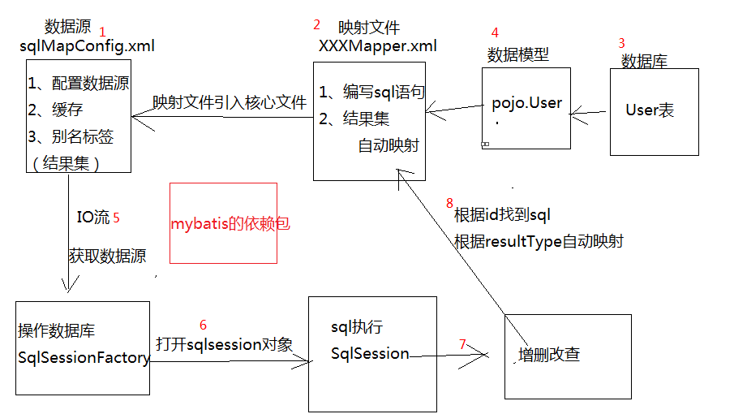
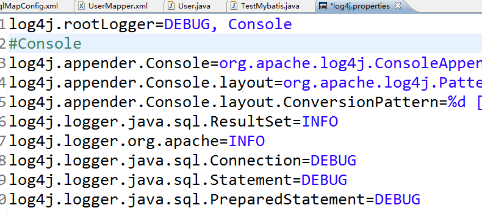

# mybatis

- [ ] mybatis框架的入门和使用

## 原生态的jdbc缺点

* 原生`jbdc`需要频繁地打开和关闭数据库
* `jdbc`主要是`sql`语句的书写与规范，较高的学习成本
* `jdbc`本身 **不具有缓存机制**
* `jdbc`每一个步骤都需要手动编写
* 对 **结果集的封装** 需要手动编写
* `sql`语句写在程序中

## spring的jdbcTemplate

优点：对`jdbc`的数据源、连接、语句预编译对象进行了封装
缺点：`sql`语句写在程序中

## Hibernate框架

> 是一种面向对象的数据库交互框架——`Hql`

* 可以 **自动的封装结果集**，（`ORM`）**自动关系映射**
* 进行数据库操作时，只需要对象传入增删改查的方法即可
* 产生 **大量冗余** `sql`

## mybatis框架（半自动的ORM）

* 可以自动的封装结果集
* sql语句需要程序员在配置文件中完成



## 入门案例

1. 导包
2. 配置文件`sqlMapConfig.xml`

    ``` xml
    <?xml version="1.0" encoding="UTF-8" ?>
    <!DOCTYPE configuration
    PUBLIC "-//mybatis.org//DTD Config 3.0//EN"
    "http://mybatis.org/dtd/mybatis-3-config.dtd">
    <configuration>
    	<!-- 配置数据源 -->
    	<environments default="mysql">
    		<environment id="mysql">
    			<transactionManager type="JDBC" />
    			<dataSource type="POOLED">
    				<property name="driver" value="com.mysql.jdbc.Driver" />
    				<property name="url" value="jdbc:mysql://localhost:3306/mybatis?characterEncoding=utf-8" />
    				<property name="username" value="root" />
    				<property name="password" value="root" />
    			</dataSource>
    		</environment>

    		<environment id="oracle">
    			<transactionManager type="JDBC" />
    			<dataSource type="POOLED">
    				<property name="driver" value="oracle.jdbc.driver.OracleDriver" />
    				<property name="url" value="jdbc:oracle:thin:@127.0.0.1:1521:XE" />
    				<property name="username" value="ht1602" />
    				<property name="password" value="htdb" />
    			</dataSource>
    		</environment>
    	</environments>

    	<!-- 映射文件 -->
    	<mappers>
    		<mapper resource="pojo/UserMapper.xml" />
    	</mappers>

    </configuration>
    ```

3. 配置`UserMapper.xml`映射文件    

    ``` xml
    <?xml version="1.0" encoding="UTF-8" ?>
    <!DOCTYPE mapper
    PUBLIC "-//mybatis.org//DTD Mapper 3.0//EN"
    "http://mybatis.org/dtd/mybatis-3-mapper.dtd">
    <!-- 用于唯一标识当前的映射文件 -->
    <mapper namespace="pojo.UserMapper">

    	<!--
    		基本的sql语句对应的标签
    	<insert id="sql语句的唯一标识"></insert>
    	<update id=""></update>
    	<delete id=""></delete>
    	<select id=""></select> -->

    	<select id="findAll" resultType="pojo.User">
    		select * from user
    	</select>

    	<insert id="addUser">
    		insert into user (id,name,age,sex)
    		values (null,#{name},#{age},#{sex})
    	</insert>

    	<delete id="deleteUser">
    		delete from user where id=#{id}
    	</delete>

    	<update id="updateUser">
    		update user set name=#{name},age=#{age},sex=#{sex}
    		where id=#{id}
    	</update>

    	<select id="findOrder" resultType="pojo.User">
    		select * from user order by ${column}
    	</select>
    </mapper>
    ```

4. 编写`pojo`的数据模型

    ``` java
    public class User {
        private int id;
        private String name;
        private int age;
        private String sex;
    }
    ```

5. 编写测试类

    ``` java
    package test;

    import java.io.IOException;
    import java.io.InputStream;
    import java.util.HashMap;
    import java.util.List;

    import org.apache.ibatis.io.Resources;
    import org.apache.ibatis.session.SqlSession;
    import org.apache.ibatis.session.SqlSessionFactory;
    import org.apache.ibatis.session.SqlSessionFactoryBuilder;
    import org.junit.Before;
    import org.junit.Test;

    import pojo.User;

    public class TestMybatis {

    	private InputStream is ;

    	private SqlSessionFactory factory;

    	private SqlSession sqlSession;

    	@Before
    	public void before() throws IOException {
    		//通过流获取核心配置文件 sqlMapConfig.xml
    		is = Resources.getResourceAsStream("sqlMapConfig.xml");
    		//获取数据源
    		factory =
    				new SqlSessionFactoryBuilder().build(is);
    		//打开sqlsession对象
    		sqlSession = factory.openSession();
    	}

    	//查询
    	@Test
    	public void test01() throws IOException {
    		//通过流获取核心配置文件 sqlMapConfig.xml
    		InputStream is = Resources.getResourceAsStream("sqlMapConfig.xml");
    		//获取数据源
    		SqlSessionFactory factory =
    				new SqlSessionFactoryBuilder().build(is);
    		//打开sqlsession对象
    		SqlSession sqlSession = factory.openSession();
    		//进行数据库的操作
    		List<User> list = sqlSession.selectList("pojo.UserMapper.findAll");
    		for (User user : list) {
    			System.out.println(user);
    		}
    	}

    	//新增
    	@Test
    	public void test02() {
    		User user = new User();
    		user.setAge(13);
    		user.setName("张三丰");
    		user.setSex("男");
    		sqlSession.insert("pojo.UserMapper.addUser", user);
    		//事务的提交
    		sqlSession.commit();
    	}

    	//删除
    	@Test
    	public void test03() {
    		int id = 1;
    		sqlSession.delete("pojo.UserMapper.deleteUser", id);
    		//事务的提交
    		sqlSession.commit();
    	}

    	//修改
    	@Test
    	public void test04() {

    		User user = new User();
    		user.setAge(13);
    		user.setName("张三风");
    		user.setSex("男");
    		user.setId(3);

    		sqlSession.update("pojo.UserMapper.updateUser", user);
    		//事务的提交
    		sqlSession.commit();
    	}

    	//排序查询
    	@Test
    	public void test05() throws IOException {

    		// 定义一个map集合
    		HashMap<String, String> map =
    				new HashMap<String,String>();
    		map.put("column", "age");

    		//进行数据库的操作
    		List<User> list = sqlSession.
    				selectList("pojo.UserMapper.findOrder",map);
    		for (User user : list) {
    			System.out.println(user);
    		}
    	}

    }
    ```

## 使用`#{name}`通过`get`方法取值

* `#{name}`：通过`getName`方法获取`name`的值
* `#{name1}`：通过`getName1`方法通过`getName(return name1)`获取

## log4j日志文件的导入



## sql语句的排序

``` sql
SELECT * FROM USER ORDER BY age;
```

* `${column}`配合`map`集合使用，能够获取列名字段，而不是一个`string`类型的值

``` xml
<select id="findOrder" resultType="pojo.User">
    select * from user order by ${column}
</select>
```

``` java
HashMap<String, String> map = new HashMap<>();
map.put("column", "age");

List<User> list = sqlSession.selectList("pojo.UserMapper.findOrder", map);
```

* `#{}`是获取参数中的值
* `${}`配合`map`获取列名字段
    * 能使用`#{}`就不使用`${}`，特殊情况获取列名使用`${}`
