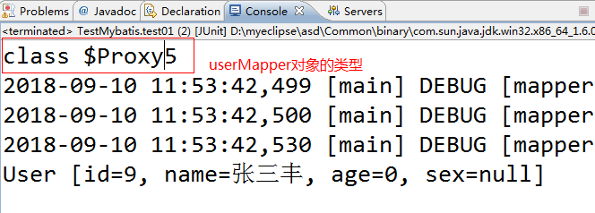
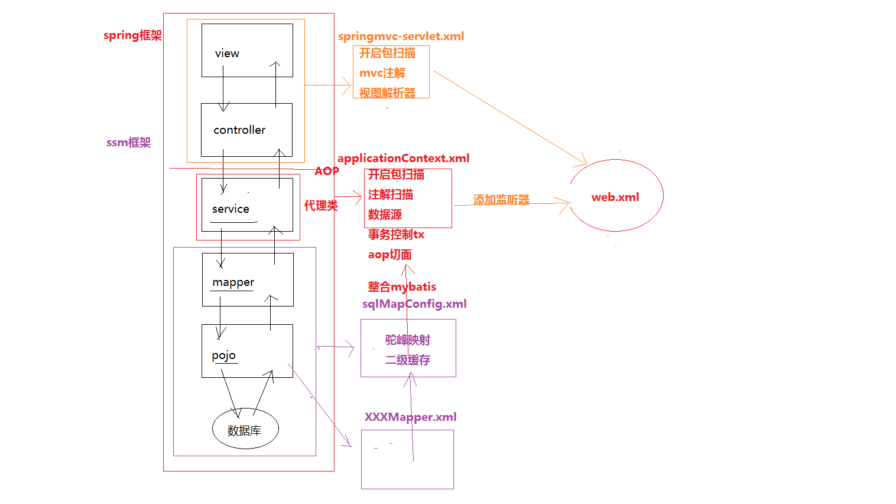
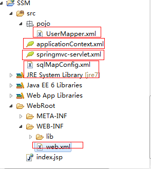

# mybatis

- [ ] mybatis对dao层的封装
- [ ] mybatis的缓存机制和驼峰映射
- [ ] mybatis的操作数据库的多表之间的关系

## mybatis对单值传递的操作

> `#{参数是任意的，但是不能不写}`

``` xml
    <select id="selectUser" resultType="User" parameterType="long">
        SELECT *
        FROM user
        WHERE id = #{id}
    </select>
```

* 使用`id`单条件查询和单条件删除时，#{参数任意}
* 使用`update`语句和`select`全部查询语句，要根据`user`模型的`get`方法取值

## mybatis多值传递——sql的区间查询

``` xml
<select id="findUserByAges" resultType="pojo.User">
    select * from user where age > 18 and age < 30
</select>
<!--xml文件认为这是标签<而不是小于号-->
```

> 解决方案：使用大段转移字符`<![CDATA[]]>`

``` xml
<select id="findUserByAges" resultType="pojo.User">
    select * from user where age > 18 and <![CDATA[age < 30]]>
</select>
```

## 动态的传入区间的两个值（同一类型的age值）

``` java
@Test
public void test02() {
    HashMap<String, Integer> map = new HashMap<>();
    int minAge = 18;
    map.put("minAge", minAge);
    int maxAge = 30;
    map.put("maxAge", maxAge);

    List<User> list = sqlSession.selectList("pojo.UserMapper.findUserByAges", map);
    for (User user : list)
        System.out.println(user);
}
```

``` xml
<select id="findUserByAges" resultType="pojo.User">
    select * from user where age > #{minAge} and <![CDATA[age < #{maxAge]]>
</select>
```

## 动态插入sql语句

``` sql
Insert into user (id,name,age,sex) values (null,#{name},#{age},#{sex})
```

需求：`user`模型中，如果只用`name`值，那么`sql`语句只插入`name`，`sql`变成了`insert into (id,name) values (null,#{name})`

> 解决方案：使用`<trim></trim>`标签

* 作用1：可以进行前缀`(`和后缀`)`的设置
* 作用2：可以使用`<if test></if>`标签判断每一个字段对应的数据模型中的值是否为空
* 作用3：可以自动的把值与列名后面的`,`去除掉

``` xml
<!-- 动态的插入语句 -->
<insert id="dynamicAddUser">
	insert into user 
		<trim prefix="(" suffix=")" suffixOverrides="," >
			id,
			<if test="name != null">name,</if>
			<if test="age != 0">age,</if>
			<if test="sex != null">sex</if>
		</trim>
	values 
		<trim prefix="(" suffix=")" suffixOverrides=",">
			null,
			<if test="name != null">#{name},</if>
			<if test="age != 0">#{age},</if>
			<if test="sex != null">#{sex}</if>
		</trim>
</insert>
```

## 动态修改sql语句

``` sql
Update user set name = #{name},age = #{age} , sex = #{sex} Where id = #{id}
```

需求：动态的根据`user`模型中的数据进行`sql`语句的编写

> 解决方案：使用`<set></set>`标签，代替了`sql` 语句中`set`关键字

* 作用1：可以进行动态的判断`user`模型中的值是否为空
* 作用2：可以去除字段末尾的`,`

``` xml
<!-- 动态修改 -->
<update id="dynamicUpdateUser">
    update user 
        <set>
            <if test="name != null"> name=#{name},</if>
            <if test="age != 0"> age=#{age},</if>
            <if test="sex != null"> sex=#{sex} </if>
        </set>
    where id=#{id}
</update>
```

## 动态删除sql语句

> 解决方案：`foreach`标签

* `foreach`标签：遍历所有的`id`并获取`id`的值
* `collection=""`：可以支持三种数据结构
    * `array`：`collection="array"`
    * `list`：`collection="list"`
    * `map`：`collection="集合对应的key"`
* `open="("`：前缀`(`
* `close=")"`：后缀`)`
* `item="tempId"`：临时变量接收数组中的每一个`id`的值
* `index="i"`：循环变量可以不写
* `separator=","`：使用`,` 隔开数组中的每一个值

注意：
* 使用`array`与`list`集合，只能删除单一字段类型的多个值
* 使用`map`集合，可以删除多个字段类型的多个值

``` xml
<delete id="dynamicDeleteUserByArray">
    delete from user where id in 
    <foreach collection="array" open="(" close=")" item="tempId" index="i" separator=","  >
        #{i}
    </foreach>
</delete>
 
<delete id="dynamicDeleteUserByList">
    delete from user where id in 
    <foreach collection="list" open="(" close=")" item="tempId"  separator=","  >
        #{tempId}
    </foreach>
</delete>
 
<delete id="dynamicDeleteUserByMap">
    delete from user where id in 
<!-- 使用map集合，循环遍历list集合
collection="ids" ： ids 为 map中的key
 -->
    <foreach collection="ids" open="(" close=")" item="tempId"  separator=","  >
        #{tempId}
    </foreach>
    or sex=#{sex}
</delete>
```

* `foreach`不只可以用在`delete`语句中，
也可以根据需求在`select`与`update`中使用

## sql复用的问题

> 在映射文件中，使用`<sql>`标签

``` xml
<sql id="selectUser">
    select * from user
</sql>

<select id="findOne" resultType="User">
    <include refid="selectUser"/>where id = #{sdf}
</select>
```

## Mybatis对dao层的封装以及方法的调用

原来的`dao`层：`UserDao`接口和`UserDaoImpl`实现类
`Mybatis`的`dao`层：`UserMapper`接口（提供`crud`的方法）底层使用`jdk`的动态代理创建`userMapper`的代理对象
使用的`API`：`sqlSession.getMapper(UserMapper.class);`

### 实现步骤

1. 编写`UserMapper`的接口

    ``` java
    package mapper;

    import java.util.HashMap;
    import java.util.List;

    import pojo.User;

    //接口：是执行crud的方法
    //注意：方法签名  一定要和  映射文件中的sql语句的id一致
    public interface UserMapper {
        
        public User findOne(int id);
        
        /* UserMapper方法：取代了 CRUD
        * 取代了 它-->
        *  List<User> list = sqlSession.selectList
                    ("pojo.UserMapper.findUserByAges", map);
        */
        public List<User> findUserByAges(HashMap<String,Integer> map);

    }
    ```

2. 修改`UserMapper.xml`文件

    ``` xml
    <?xml version="1.0" encoding="UTF-8" ?>
    <!DOCTYPE mapper
    PUBLIC "-//mybatis.org//DTD Mapper 3.0//EN"
    "http://mybatis.org/dtd/mybatis-3-mapper.dtd">
    <!-- 用于唯一标识当前的映射文件 -->
    <mapper namespace="mapper.UserMapper">
        
        <!-- sql复用问题：作为公共的查询语句 -->
        <sql id="selectUser">
            select * from user 
        </sql>
        
        <!-- 单值传递问题 -->
        <select id="findOne" resultType="User">
            <!-- select * from user where id=#{idqweqwe} -->
            <include refid="selectUser"/> where id=#{sdf}
        </select>
        
        <!-- 多值传递问题  区间查询 -->
        <select id="findUserByAges" resultType="User">
            select * from user where age > #{minAge} and 
            <!-- xml文件会根据   转义字符 进行  转义<>标签的形式   -->
            <![CDATA[age < #{maxAge}]]>
        </select>
        
        <!-- 动态的插入语句 -->
        <insert id="dynamicAddUser">
            insert into user 
                <trim prefix="(" suffix=")" suffixOverrides="," >
                    id,
                    <if test="name != null">name,</if>
                    <if test="age != 0">age,</if>
                    <if test="sex != null">sex</if>
                </trim>
            values 
                <trim prefix="(" suffix=")" suffixOverrides=",">
                    null,
                    <if test="name != null">#{name},</if>
                    <if test="age != 0">#{age},</if>
                    <if test="sex != null">#{sex}</if>
                </trim>
        </insert>
        
        <!-- 动态修改 -->
        <update id="dynamicUpdateUser">
            update user 
                <set>
                    <if test="name != null"> name=#{name},</if>
                    <if test="age != 0"> age=#{age},</if>
                    <if test="sex != null"> sex=#{sex} </if>
                </set>
            where id=#{id}
        </update>
        <!-- foreach标签  ： 遍历  所有的id 并获取id的值
                    collection="" : 可以支持三种数据结构：array list map 
                                特殊用法：array数组  collection="array"
                                    list集合    collection="list" 
                                    map映射       collection="？？？"
                    open="("  : 前缀 ( 
                    close=")" : 后缀 )
                    item="tempId" : 临时变量 接收 数组中的每一个id的值
                    index="i" : 循环变量  可以不写
                    separator="," 使用, 隔开 数组中的每一个值
                -->
        <delete id="dynamicDeleteUserByArray">
            delete from user where id in 
                <foreach collection="array" open="(" close=")" item="tempId" index="i" separator=","  >
                    #{i}
                </foreach>
        </delete>
        
        <delete id="dynamicDeleteUserByList">
            delete from user where id in 
                <foreach collection="list" open="(" close=")" item="tempId"  separator=","  >
                    #{tempId}
                </foreach>
        </delete>
        
        <delete id="dynamicDeleteUserByMap">
            delete from user where id in 
                <!-- 使用map集合，循环遍历list集合
                    collection="ids" ： ids 为 map中的key
                -->
                <foreach collection="ids" open="(" close=")" item="tempId"  separator=","  >
                    #{tempId}
                </foreach>
            or sex=#{sex}
        </delete>
        
    </mapper>
    ```

3. 单元测试

    ``` java
        //单值传递:使用UserMapper接口
        @Test
        public void test01() {
            int id = 9;
    //		User user = sqlSession.selectOne
    //				("pojo.UserMapper.findOne", id);
            //获取了一个 userMapper的对象
            //底层使用了jdk的动态代理：逆向的生成了一个代理对象
            UserMapper userMapper = sqlSession.
                    getMapper(UserMapper.class);
            System.out.println(userMapper.getClass());
            
            //使用对象操作CRUD
            User user = userMapper.findOne(9);
            System.out.println(user);
        }
    ```

底层的结果输出：`userMapper`为`jdk`动态代理创建的代理对象



## 数据表之间的关联关系

### 一对一的关系

主从关系：`person`是主表`personinfo`是从表

``` java
public class Person {
	//对应数据库字段 ： 最好使用驼峰式
	private int personId;
	private String personName;
	private int personAge;
	
	//一对一的关系：person为主表，那么personinfo是作为成员变量
	private PersonInfo personInfo;
```

``` java
public class PersonInfo {
	
	private int personId;
	private String personAddress;
	private String personTel;
	private String personQq;
```

编写`PersonMapper.java`接口 ：提供一个方法 -- 查询全部信息

``` java
public interface PersonMapper {
	
	//查询全部的人类信息
	public List<Person> findPersonAll();
}
```

编写`PersonMapper.xml`的映射文件

``` xml
<?xml version="1.0" encoding="UTF-8" ?>
<!DOCTYPE mapper
PUBLIC "-//mybatis.org//DTD Mapper 3.0//EN"
"http://mybatis.org/dtd/mybatis-3-mapper.dtd">
<!-- 用于唯一标识当前的映射文件 -->
<mapper namespace="mapper.PersonMapper">
	
	<!-- 手动封装结果集
		type="pojo.Person"  类型 perosn所在的包名.类名
		id="personRM"  该结果集的 唯一标识 自定义的
	 -->
	<resultMap type="pojo.Person" id="personRM"
	 autoMapping="true">
		<!-- 主表中的id，必须写 
		    column="person_id"  person表中的列名
			property="personId" person类中的属性
		-->
		<id column="person_id" property="personId"  />
		<!-- 主表中的其他字段 -->
		<!-- <result column="person_name" property="personName" />
		<result column="person_age" property="personAge" /> -->
		<!-- 一对一映射关系专用 association ：从表 
			property="" 表示 属性名 ：person类中的personInfo
			javaType="" 表示  属性的类型 ：PersonInfo类型 
		-->
		<association property="personInfo" javaType="pojo.PersonInfo">
			<!-- 必须写 -->
			<id column="person_id" property="personId" />
			<result column="person_address" property="personAddress" />
			<result column="person_tel" property="personTel" />
			<result column="person_qq" property="personQq" />
		</association>
	</resultMap>
	
	<!-- 查询全部的信息 -->
	<select id="findPersonAll" resultMap="personRM">
		select p.*,i.person_address,i.person_tel,
		i.person_qq 
		from person p , personinfo i 
		where p.person_id=i.person_id 
	</select>
</mapper>
```

编写核心配置文件 ：`sqlMapConfig.xml`

``` xml
<?xml version="1.0" encoding="UTF-8" ?>
<!DOCTYPE configuration
PUBLIC "-//mybatis.org//DTD Config 3.0//EN"
"http://mybatis.org/dtd/mybatis-3-config.dtd">
<configuration>
	
	<!-- 开启驼峰映射
		person_id 映射为  personId
	 -->
	<settings>
		<setting name="mapUnderscoreToCamelCase" 
		value="true"/>
	</settings>
	
	<!-- 别名标签 -->
	<typeAliases>
		<typeAlias type="pojo.User" alias="User" />
	</typeAliases>
	
	<!-- 配置数据源 -->
	<environments default="mysql">
		<environment id="mysql">
			<transactionManager type="JDBC" />
			<dataSource type="POOLED">
				<property name="driver" value="com.mysql.jdbc.Driver" />
				<property name="url" value="jdbc:mysql://localhost:3306/mybatis?characterEncoding=utf-8" />
				<property name="username" value="root" />
				<property name="password" value="root" />
			</dataSource>
		</environment>
		
		<environment id="oracle">
			<transactionManager type="JDBC" />
			<dataSource type="POOLED">
				<property name="driver" value="oracle.jdbc.driver.OracleDriver" />
				<property name="url" value="jdbc:oracle:thin:@127.0.0.1:1521:XE" />
				<property name="username" value="ht1602" />
				<property name="password" value="htdb" />
			</dataSource>
		</environment>
	</environments>
	
	
	<!-- 映射文件 -->
	<mappers>
		<mapper resource="pojo/UserMapper.xml" />
		<mapper resource="pojo/PersonMapper.xml" />
		<mapper resource="pojo/DeptMapper.xml" />
		<mapper resource="pojo/TeacherMapper.xml" />
	</mappers>

</configuration>
```

编写映射文件：使用<result>标签，进行映射

``` xml
<?xml version="1.0" encoding="UTF-8" ?>
<!DOCTYPE mapper
PUBLIC "-//mybatis.org//DTD Mapper 3.0//EN"
"http://mybatis.org/dtd/mybatis-3-mapper.dtd">
<!-- 用于唯一标识当前的映射文件 -->
<mapper namespace="mapper.PersonMapper">
	
	<!-- 手动封装结果集
		type="pojo.Person"  类型 perosn所在的包名.类名
		id="personRM"  该结果集的 唯一标识 自定义的
	 -->
	<resultMap type="pojo.Person" id="personRM"
	 autoMapping="true">
		<!-- 主表中的id，必须写 
		    column="person_id"  person表中的列名
			property="personId" person类中的属性
		-->
		<id column="person_id" property="personId"  />
		<!-- 主表中的其他字段 -->
		<!-- <result column="person_name" property="personName" />
		<result column="person_age" property="personAge" /> -->
		<!-- 一对一映射关系专用 association ：从表 
			property="" 表示 属性名 ：person类中的personInfo
			javaType="" 表示  属性的类型 ：PersonInfo类型 
		-->
		<association property="personInfo" javaType="pojo.PersonInfo">
			<!-- 必须写 -->
			<id column="person_id" property="personId" />
			<result column="person_address" property="personAddress" />
			<result column="person_tel" property="personTel" />
			<result column="person_qq" property="personQq" />
		</association>
	</resultMap>
	
	<!-- 查询全部的信息 -->
	<select id="findPersonAll" resultMap="personRM">
		select p.*,i.person_address,i.person_tel,
		i.person_qq 
		from person p , personinfo i 
		where p.person_id=i.person_id 
	</select>
</mapper>
```

### 开启驼峰映射

``` xml
<!-- 开启驼峰映射
		person_id 映射为  personId
	 -->
	<settings>
		<setting name="mapUnderscoreToCamelCase" 
		value="true"/>
	</settings>

    <resultMap type="pojo.Person" id="personRM"
	 autoMapping="true">
		<!-- 主表中的id，必须写 
		    column="person_id"  person表中的列名
			property="personId" person类中的属性
		-->
		<id column="person_id" property="personId"  />
```

### 一对多的映射关系

主从关系：主表`dept`表，从表`user`表

编写`DeptMapper`接口

``` java
public interface DeptMapper {
	
	public List<Dept> findDeptAll();
}
```

编写映射文件`DeptMapper.xml`

``` xml
<?xml version="1.0" encoding="UTF-8" ?>
<!DOCTYPE mapper
PUBLIC "-//mybatis.org//DTD Mapper 3.0//EN"
"http://mybatis.org/dtd/mybatis-3-mapper.dtd">
<!-- 用于唯一标识当前的映射文件 -->
<mapper namespace="mapper.DeptMapper">
	
	<resultMap type="pojo.Dept" id="deptRM" 
	autoMapping="true" >
		<id column="dept_id" property="deptId" />
		
		<!-- 一对多的映射关系 
			ofType="pojo.User"  类型为  list集合中的泛型
		-->
		<collection property="userList" ofType="User" >
			<id column="id" property="id" />
			<result column="name" property="name" />
			<result column="age" property="age" />
			<result column="sex" property="sex"/>
		</collection>
	</resultMap>
	
	<select id="findDeptAll" resultMap="deptRM">
		select d.dept_name,u.* from 
		dept d 
		left join 
		user u 
		on d.dept_id=u.dept_id
	</select>
</mapper>
```

编写核心配置文件`sqlMapConfig.xml`

``` xml
	<!-- 映射文件 -->
	<mappers>
		<mapper resource="pojo/UserMapper.xml" />
		<mapper resource="pojo/PersonMapper.xml" />
		<mapper resource="pojo/DeptMapper.xml" />
		<mapper resource="pojo/TeacherMapper.xml" />
	</mappers>
```

### 多对多的映射关系

主从关系：
从teacher的角度出发：那么teacher是主表，student是从表
从student的角度出发：那么student是主表，teacher是从表

``` java
public class Teacher {
	
	private int tId;
	private String tName;
	private int tAge;
	
	//从老师的角度，描述多对多 ：相当于 一个老师对多个学生
	private List<Student> sList;
```

``` java
public class Student {
	
	private int sId;
	private String sName;
	private String sSex;
```

``` java
public interface TeacherMapper {
	
	//查询所有老师对应的学生
	public List<Teacher> findTeacherAll();
}
```

``` xml
<?xml version="1.0" encoding="UTF-8" ?>
<!DOCTYPE mapper
PUBLIC "-//mybatis.org//DTD Mapper 3.0//EN"
"http://mybatis.org/dtd/mybatis-3-mapper.dtd">
<!-- 用于唯一标识当前的映射文件 -->
<mapper namespace="mapper.TeacherMapper">
	
	<resultMap type="pojo.Teacher" id="tsRM" autoMapping="true">
		<id column="t_id" property="tId" />
		<!-- student表 -->
		<collection property="sList" ofType="pojo.Student">
			<id column="s_id" property="sId" />
			<result column="s_name" property="sName" />
			<result column="s_sex" property="sSex" />
		</collection>
	</resultMap>
	
	<select id="findTeacherAll" resultMap="tsRM">
		select tt.*,s.s_name,s.s_sex from 
		(select t.*,st.s_id from 
		teacher t 
		left join 
		s_t st 
		on t.t_id = st.t_id ) tt 
		left join 
		student s 
		on tt.s_id=s.s_id
	</select>
</mapper>
```

## SSM框架的搭建



1. 创建一个`web`工程：导包、创建需要的核心配置文件5个

    

2. `web.xml`配置文件中，加载`springmvc-servlet.xml`文件

    ``` xml
        <servlet>
            <servlet-name>springmvc</servlet-name>
            <servlet-class>org.springframework.web.servlet.DispatcherServlet</servlet-class>
            <init-param>
                <param-name>contextConfigLocation</param-name>
                <param-value>classpath:/springmvc-servlet.xml</param-value>
            </init-param>
        </servlet>
        <servlet-mapping>
            <servlet-name>springmvc</servlet-name>
            <url-pattern>/</url-pattern>
        </servlet-mapping>
    ```

3. `web.xml`配置文件中，加载编码过滤器

    ``` xml
        <filter>
            <filter-name>encodingFilter</filter-name>
            <filter-class>org.springframework.web.filter.CharacterEncodingFilter</filter-class>
            <init-param>
                <param-name>encoding</param-name>
                <param-value>utf-8</param-value>
            </init-param>
        </filter>
        <filter-mapping>
            <filter-name>encodingFilter</filter-name>
            <url-pattern>/*</url-pattern>
        </filter-mapping>
    ```

4. `web.xml`配置文件中，加载`spring`的核心配置文件`applicationContext.xml`

    ``` xml
        <!-- 在web容器中，引入spring的核心配置文件 -->
        <context-param>
            <param-name>contextConfigLocation</param-name>
            <param-value>classpath:/applicationContext.xml</param-value>
        </context-param>
        
        <!-- 在web容器中，使用监听器加载spring的核心配置，web容器一启动 就在spring -->
        <listener>
            <listener-class>org.springframework.web.context.ContextLoaderListener</listener-class>
        </listener>
    ```

5. 配置`springmvc-servlet.xml`文件

    ``` xml
    <?xml version="1.0" encoding="UTF-8"?>
    <beans xmlns="http://www.springframework.org/schema/beans" 
        xmlns:context="http://www.springframework.org/schema/context" 
        xmlns:mvc="http://www.springframework.org/schema/mvc" 
        xmlns:xsi="http://www.w3.org/2001/XMLSchema-instance" 
        xsi:schemaLocation="http://www.springframework.org/schema/beans 
        http://www.springframework.org/schema/beans/spring-beans-3.2.xsd
        http://www.springframework.org/schema/context 
        http://www.springframework.org/schema/context/spring-context-3.2.xsd
        http://www.springframework.org/schema/mvc 
        http://www.springframework.org/schema/mvc/spring-mvc-3.2.xsd">
        
        <!-- 开启包扫描 -->
        <context:component-scan base-package="cn.tedu.controller"/>
        
        <!-- 开启mvc的注解扫描 -->
        <mvc:annotation-driven/>
        
        <!-- 配置视图解析器 -->
        <bean class="org.springframework.web.servlet.view.InternalResourceViewResolver">
            <property name="prefix" value="/WEB-INF/"/>
            <property name="suffix" value=".jsp"/>
        </bean>
    </beans>
    ```

6. 配置`spring`的核心配置文件：`applicationContext.xml`

    ``` xml
    <?xml version="1.0" encoding="UTF-8"?>
    <beans xmlns="http://www.springframework.org/schema/beans" 
        xmlns:context="http://www.springframework.org/schema/context" 
        xmlns:tx="http://www.springframework.org/schema/tx" 
        xmlns:aop="http://www.springframework.org/schema/aop" 
        xmlns:xsi="http://www.w3.org/2001/XMLSchema-instance" 
        xsi:schemaLocation="http://www.springframework.org/schema/beans 
        http://www.springframework.org/schema/beans/spring-beans-3.2.xsd
        http://www.springframework.org/schema/context 
        http://www.springframework.org/schema/context/spring-context-3.2.xsd
        http://www.springframework.org/schema/tx 
        http://www.springframework.org/schema/tx/spring-tx-3.2.xsd
        http://www.springframework.org/schema/aop 
        http://www.springframework.org/schema/aop/spring-aop-3.2.xsd">
        
        <!-- 开启包扫描 -->
        <context:component-scan base-package="cn.tedu.service"/>
        
        <!-- 引入外部的配置文件 -->
        <context:property-placeholder location="classpath:/jdbc.properties" />
        
        <!-- 引入c3p0数据源 -->
        <bean id="dataSource" class="com.mchange.v2.c3p0.ComboPooledDataSource">
            <property name="driverClass" value="${jdbcDriver}"/>
            <property name="jdbcUrl" value="${jdbcUrl}"/>
            <property name="user" value="${jdbcUser}"/>
            <property name="password" value="${jdbcPwd}"/>
            <property name="maxPoolSize" value="20"/>
            <property name="minPoolSize" value="5"/>
        </bean>
        
        <!-- 配置事务管理器 -->
        <bean id="transactionManager" class="org.springframework.jdbc.datasource.DataSourceTransactionManager">
            <property name="dataSource" ref="dataSource"></property>
        </bean>
        
        <!-- 配置事务通知 -->
        <tx:advice id="txAdvice" transaction-manager="transactionManager">
            <tx:attributes>
                <tx:method name="add*" propagation="REQUIRED"/>
                <tx:method name="update*" propagation="REQUIRED"/>
                <tx:method name="delete*" propagation="REQUIRED"/>
                <tx:method name="find*" propagation="SUPPORTS" read-only="true"/>
                <tx:method name="*" read-only="true"/>
            </tx:attributes>
        </tx:advice>
        
        <!-- 配置事务切面 -->
        <aop:config>
            <aop:pointcut expression="execution(* service..*.*(..))" id="pc"/>
            <aop:advisor advice-ref="txAdvice" pointcut-ref="pc"/>
        </aop:config>
        
        <!-- 整合mybatis -->
        <bean id="sqlSessionFactory" class="org.mybatis.spring.SqlSessionFactoryBean">
            <!-- 引入数据源 -->
            <property name="dataSource" ref="dataSource"/>
            <!-- 引入mybatis核心配置文件 -->
            <property name="configLocation" value="classpath:/sqlMapConfig.xml"/>
            <!-- 引入映射文件 -->
            <property name="mapperLocations" value="classpath:/cn/tedu/pojo/*.xml"/>
        </bean>
        
        <!-- 为mapper接口生成代理对象 -->
        <bean class="org.mybatis.spring.mapper.MapperScannerConfigurer">
            <property name="basePackage" value="cn.tedu.mapper"></property>
        </bean>
    </beans>
    ```

7. `spring`整合`mybatis`

    ``` xml
    <!-- 整合mybatis -->
    <bean id="sqlSessionFactory" class="org.mybatis.spring.SqlSessionFactoryBean">
        <!-- 引入数据源 -->
        <property name="dataSource" ref="dataSource"/>
        <!-- 引入mybatis核心配置文件 -->
        <property name="configLocation" value="classpath:/sqlMapConfig.xml"/>
        <!-- 引入映射文件 -->
        <property name="mapperLocations" value="classpath:/cn/tedu/pojo/*.xml"/>
    </bean>
            
    <!-- 为mapper接口生成代理对象 -->
    <bean class="org.mybatis.spring.mapper.MapperScannerConfigurer">
        <property name="basePackage" value="cn.tedu.mapper"></property>
    </bean>
    ```

8. 配置`sqlMapConfig.xml`文件

    ``` xml
    <?xml version="1.0" encoding="UTF-8" ?>
    <!DOCTYPE configuration
    PUBLIC "-//mybatis.org//DTD Config 3.0//EN"
    "http://mybatis.org/dtd/mybatis-3-config.dtd">
    <configuration>
        
        <!-- 开启 二级缓存  以及  驼峰映射 -->
        <settings>
            <setting name="mapUnderscoreToCamelCase" value="true"/>
            <setting name="cacheEnabled" value="true"/>
        </settings>
        
        <!-- 别名标签 -->
        <typeAliases>
            <typeAlias type="cn.tedu.pojo.User" alias="User"/>
        </typeAliases>
        
    </configuration>
    ```

9. 配置`UserMapper.xml`文件

    ``` xml
    <?xml version="1.0" encoding="UTF-8" ?>
    <!DOCTYPE mapper
    PUBLIC "-//mybatis.org//DTD Mapper 3.0//EN"
    "http://mybatis.org/dtd/mybatis-3-mapper.dtd">

    <mapper namespace="cn.tedu.mapper.UserMapper">    
        <!-- 查询user表中的全部信息 -->
        <select id="findUserAll" resultType="User">
            select * from user 
        </select>
    </mapper>
    ```

10. 编写各个层的代码与依赖注入